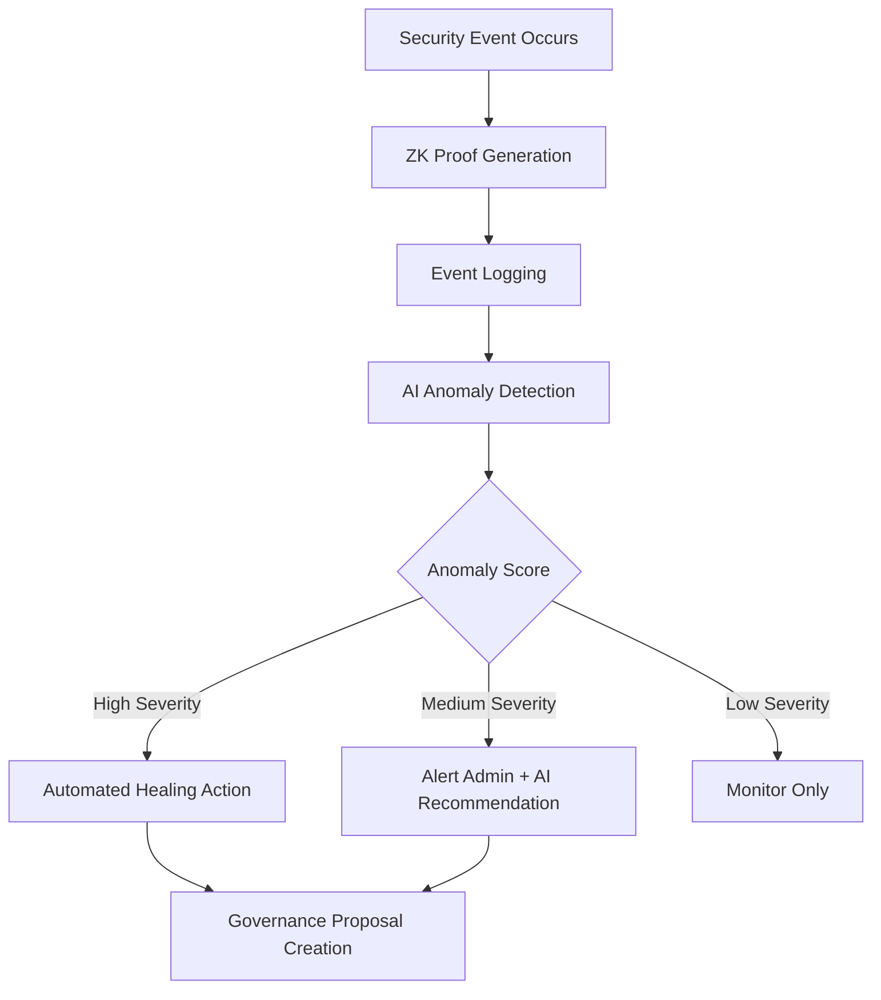
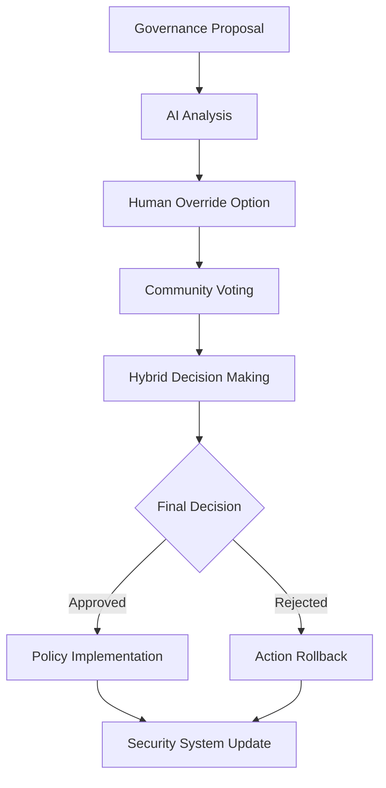

# Integration of Self-Healing Security and Hybrid Governance Systems

## Overview

This document explains how the Self-Healing Security System and Hybrid Governance System work together to create a robust, autonomous, yet human-overseen infrastructure for the DEX-OS platform. The integration enables automated security responses while ensuring governance oversight and community involvement in critical decisions.

## System Interaction Flow

### 1. Security Incident Detection and Response



### 2. Governance Review and Approval



## Integration Scenarios

### Scenario 1: Automated Security Response with Governance Oversight

1. **Incident Detection**: The self-healing security system detects a coordinated network attack
2. **Automated Response**: System automatically isolates affected components and blocks malicious IPs
3. **Governance Trigger**: An AI-generated governance proposal is automatically created to review the response
4. **Human Review**: Security experts and governance council review and approve the automated actions
5. **Policy Update**: Based on the incident, security policies may be updated to prevent future occurrences

### Scenario 2: Proactive Security Policy Changes

1. **AI Analysis**: The hybrid governance system identifies a need for enhanced security measures
2. **Proposal Creation**: An AI-generated proposal suggests lowering anomaly detection thresholds
3. **Community Discussion**: Community members debate the implications of more aggressive security measures
4. **Expert Override**: Security experts provide specialized insights on the proposal
5. **Implementation**: Approved changes are automatically pushed to the security system

## Data Flow Between Systems

### Security System to Governance System

```rust
// Security incident data sent to governance for review
struct SecurityIncidentReport {
    incident_id: String,
    event_type: SecurityEventType,
    severity: f64,
    timestamp: u64,
    affected_components: Vec<String>,
    automated_response: HealingAction,
    response_success: bool,
    ai_confidence: f64,
}
```

### Governance System to Security System

```rust
// Governance decisions that affect security policies
struct SecurityPolicyUpdate {
    policy_id: String,
    update_type: PolicyUpdateType,
    new_parameters: HashMap<String, String>,
    effective_timestamp: u64,
    approved_by: Vec<TraderId>,
    ai_recommendation: Option<AIRecommendation>,
}
```

## Benefits of Integration

### 1. Rapid Response with Accountability
- Security incidents are addressed immediately through automated responses
- All actions are logged and reviewed through the governance process
- Community maintains oversight of critical security decisions

### 2. Intelligent Decision Making
- AI provides data-driven analysis for both security and governance decisions
- Human expertise guides critical judgments where AI confidence is low
- Historical data informs both systems for continuous improvement

### 3. Adaptive Security Posture
- Governance decisions can dynamically adjust security policies
- Security system performance metrics inform governance priorities
- Feedback loops enable both systems to learn from each other

## Implementation Example

```rust
use dex_core::security::self_healing::SelfHealingSecuritySystem;
use dex_core::governance::HybridGovernanceSystem;
use dex_core::prediction_engine::PredictionEngine;

// Integrated system workflow
fn integrated_security_governance_workflow() {
    // Initialize both systems
    let security_engine = PredictionEngine::new(/* security models */);
    let mut security_system = SelfHealingSecuritySystem::new(security_engine);
    
    let governance_engine = PredictionEngine::new(/* governance models */);
    let dao = GlobalDAO::new(); // Pre-populated with members
    let mut governance_system = HybridGovernanceSystem::new(dao, governance_engine);
    
    // 1. Security incident occurs
    let event_id = security_system.log_security_event(
        SecurityEventType::NetworkIntrusion,
        "firewall".to_string(),
        0.95, // High severity
        event_data,
    );
    
    // 2. Automated response executed
    let healing_response = security_system.get_healing_response(&event_id);
    
    // 3. Governance proposal automatically created
    let proposal_description = format!(
        "Review of automated response to security incident {}\n\
         Response taken: {:?}\n\
         Success: {}\n\
         Recommendation: Continue monitoring or implement additional measures",
        event_id,
        healing_response.as_ref().map(|r| &r.action),
        healing_response.as_ref().map(|r| r.success).unwrap_or(false)
    );
    
    let proposal_id = governance_system.create_proposal(
        format!("Security Review: Incident {}", event_id),
        proposal_description,
        ProposalType::SecurityIncidentReview,
        Proposer::AI {
            model_id: "security_governance_bridge".to_string(),
            confidence: 0.9,
            rationale: "Automated security incident requiring governance review".to_string(),
        },
    ).expect("Failed to create governance proposal");
    
    // 4. Community and experts review
    // ... voting and override process ...
    
    // 5. Final decision affects security system
    let final_status = governance_system.tally_votes(&proposal_id)
        .expect("Failed to tally votes");
    
    match final_status {
        ProposalStatus::Passed => {
            // Implement any recommended security enhancements
            println!("Security measures approved and implemented");
        },
        ProposalStatus::Rejected => {
            // Potentially rollback automated responses
            println!("Security measures rejected, reviewing automated response");
        },
        _ => {}
    }
}
```

## Monitoring and Metrics

Both systems share metrics to provide a holistic view of platform health:

### Shared Dashboard Metrics
- Security incident frequency and resolution time
- Governance proposal approval rates for security measures
- AI confidence trends in both domains
- Human override frequency and reasons
- System performance and resource utilization

### Cross-System Alerts
- High-frequency security incidents trigger governance reviews
- Controversial governance decisions trigger additional security monitoring
- Performance degradation in either system alerts administrators

## Future Integration Opportunities

### 1. Cross-Chain Security Governance
- Coordinated security responses across multiple blockchain networks
- Unified governance for cross-chain security policies

### 2. Predictive Security Governance
- AI models predict potential security vulnerabilities
- Proactive governance proposals to address risks before incidents occur

### 3. Reputation-Based Security Policies
- Community reputation influences security access controls
- Governance-weighted security measures for trusted participants

## Conclusion

The integration of the Self-Healing Security System and Hybrid Governance System creates a powerful synergy that combines rapid automated response with democratic oversight. This approach ensures that the DEX-OS platform maintains both strong security posture and community trust through transparent, accountable decision-making processes.