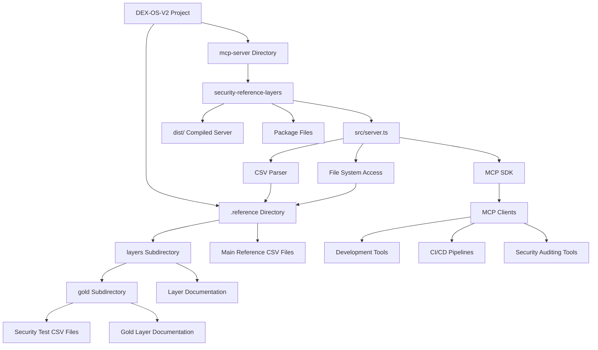

# Security Reference Layers MCP Server Architecture

## Component Diagram



## Data Flow

1. **Reference Data Storage**: Security test data is stored as CSV files in the `.reference/layers` directory
2. **MCP Server**: The TypeScript server reads and processes these CSV files
3. **Client Access**: MCP-compatible clients can query the server using standardized tools
4. **Response**: The server returns structured JSON data based on the queries

## Key Components

### 1. Reference Data Layer
- **Location**: `DEX-OS-V2/.reference/layers/`
- **Format**: CSV files containing security test cases
- **Organization**: Hierarchical structure with main layers and gold sublayer

### 2. MCP Server
- **Language**: TypeScript
- **Framework**: Model Context Protocol SDK
- **Functionality**: 
  - Parses CSV reference data
  - Exposes tools for querying security data
  - Provides structured responses

### 3. Client Interface
- **Protocol**: JSON-RPC over stdio
- **Tools**: 
  - `security.search_tests`
  - `security.get_layer_summary`
  - `security.list_test_files`

## Integration Points

### With Development Tools
```
IDE/Editor -> MCP Client -> Security Reference Layers Server -> Reference Data
```

### With CI/CD Pipelines
```
Build System -> MCP Client -> Security Reference Layers Server -> Reference Data
```

### With Security Auditing Tools
```
Audit Tool -> MCP Client -> Security Reference Layers Server -> Reference Data
```

## Scalability

The architecture supports:
- Easy addition of new reference layers
- Extension with additional tools
- Integration with multiple client types
- Performance optimization through caching